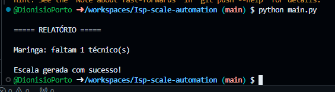

# ISP Scale Automation

## Demonstração



Automação desenvolvida em Python para auxiliar na distribuição de técnicos em operações de provedores de internet (ISP).

## Objetivo

Automatizar a geração de escalas operacionais, validar a cobertura mínima por cidade e identificar déficits de técnicos disponíveis.

## Funcionalidades

* Leitura de dados via CSV
* Validação de disponibilidade dos técnicos
* Distribuição automática por cidade
* Verificação de cobertura operacional
* Geração de alertas para cidades com déficit
* Exportação da escala gerada

## Tecnologias Utilizadas

* Python 3
* Pandas
* OpenPyXL
* Git
* GitHub

## Estrutura do Projeto

```text
isp-scale-automation/
│
├── dados/
│   ├── tecnicos.csv
│   ├── cidades.csv
│   └── escala_gerada.csv
│
├── src/
│   ├── leitor.py
│   ├── escalador.py
│   ├── exportador.py
│   └── relatorio.py
│
├── main.py
├── requirements.txt
└── README.md
```

## Fluxo da Aplicação

```text
CSV Técnicos
      ↓
Leitura de Dados
      ↓
Validação
      ↓
Geração da Escala
      ↓
Relatório
      ↓
Exportação CSV
```

## Exemplo de Saída

```text
===== RELATÓRIO =====

Maringa: faltam 1 técnico(s)

Escala gerada com sucesso!
```

## Como Executar

Instalar dependências:

```bash
pip install -r requirements.txt
```

Executar projeto:

```bash
python main.py
```

## Melhorias Futuras

* Realocação automática entre cidades
* Integração com Excel
* Dashboard operacional
* Exportação de relatórios em PDF

## Autor

Dionísio Porto

Suporte Técnico | Infraestrutura | Automação de Processos
